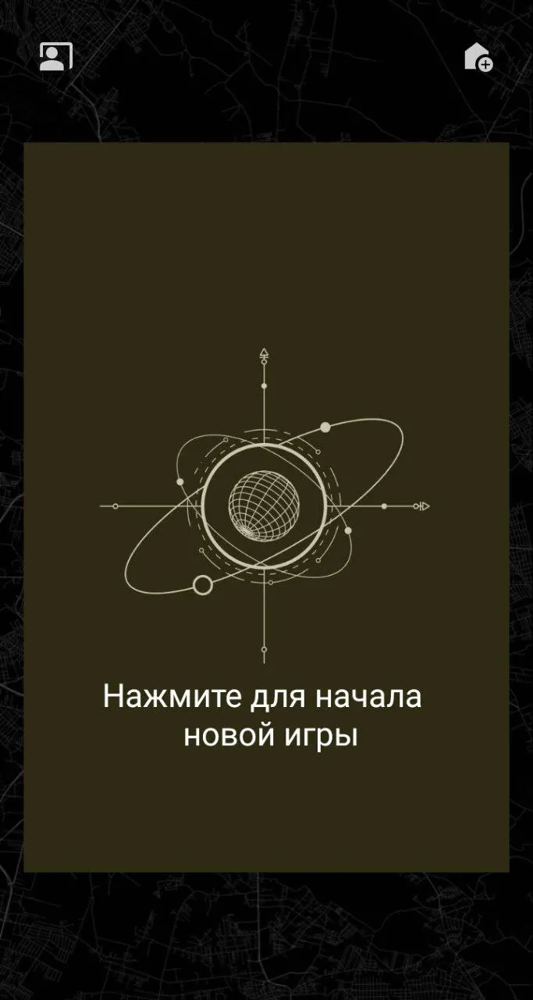
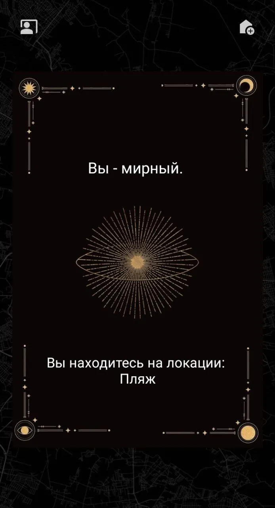

## Шпион - карточная игра

Проект размещён в rustore:
https://www.rustore.ru/catalog/app/com.yakovskij.yspy

Суть в том, что компьютером загадвается случайная локация, которая сообщается всем игрокам, кроме одного игрока. 
Реализовано путем передачи телефона следующему игроку.

Присутствуют анимации, реализован полный игровой процесс.

Можно добавлять необходимое количество игроков, новые локации. Новые уникальные локации пушатся в апи сервера, если доступен.

---

